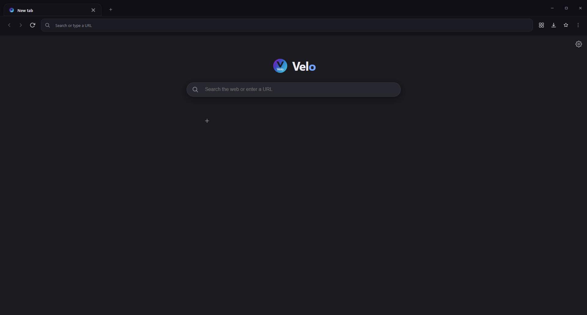
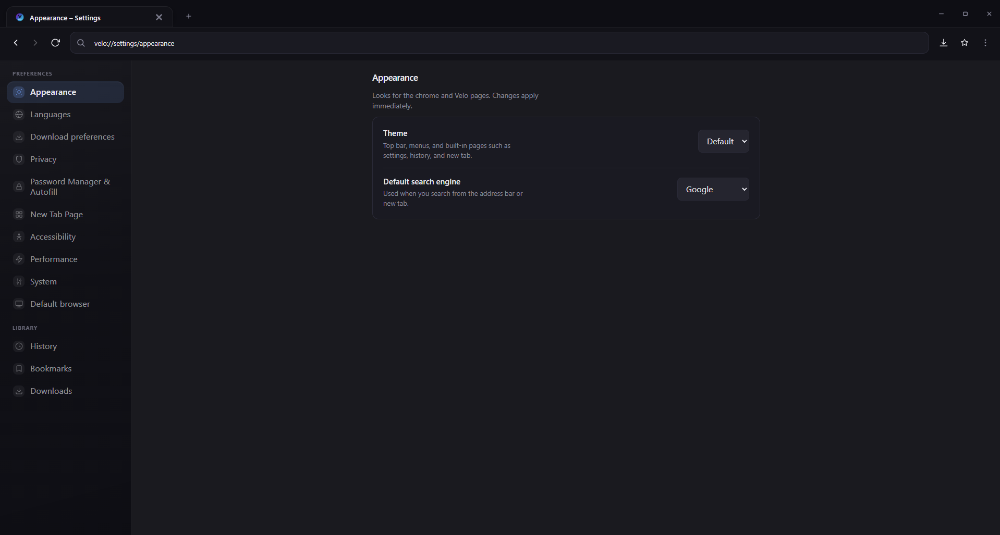

# Velo Browser

A modern, customizable desktop browser built with Electron and Chromium.

Velo focuses on clean design, performance, and control — giving you a fast, distraction-free browsing experience with powerful built-in features like ad blocking, session restore, and a secure password vault.

**Current release:** v2.0.2 (see `package.json` for the canonical version).

---

## Screenshots


| Area | Preview |
|------|---------|
| New tab |  |
| Settings |  |

---

## What you get today

- Frameless window with custom controls (Windows layout and macOS traffic-light spacing where it matters).
- Real tabs on a shared `persist:velo` content session.
- Omnibar for URLs, `velo://` pages, and search (several engines selectable in settings).
- Navigation, new tab, close tab, basic session behaviour including **restore previous session** when that option is enabled in settings.
- Internal pages: new tab, welcome, settings (including performance and appearance), history, bookmarks, downloads, password manager.
- Local **history**, **bookmarks**, and **settings** persisted on disk; **downloads** list and optional **ad blocking** (Cliqz-style engine, level configurable).
- **Password vault** with encryption at rest, unlock, CSV import/export, and autofill hooks (see settings and the capture bar when the app offers to save credentials).
- DevTools: **F12** targets the active tab; **Ctrl+Shift+I** opens the shell; menu entries mirror that.
- Packaging via **electron-builder** (Windows NSIS, macOS DMG, Linux AppImage) with bundled `public/` assets and `browser-backgrounds/` images for new-tab photos. Installed app name and main binary are **Velo** (`Velo.exe` on Windows).
- **Default browser:** Settings includes **Default browser** — register **HTTP/HTTPS** with the OS where Electron can, open system default-app settings as a fallback, and reuse a **single running instance** so links open in a new tab instead of spawning extra processes (when the OS launches Velo with a URL).

Hardening in broad terms: `contextIsolation`, no `nodeIntegration` in the shell, small preload surfaces, and IPC payloads validated with Zod. Internal-only APIs are restricted to `velo://` documents.

---

## Requirements

- **Node.js** 18 or newer (20+ is a sane default).
- **npm** (or another client that understands `package.json` scripts).

To **install a prebuilt binary**, you only need the installer for your OS (see below). You do not need Node on the machine where you only run Velo.

---

## Installing the browser

### Windows

1. Obtain `Velo-Installer-Windows-1.0.0.exe` from the releases on this repo (or build it yourself; see **Building**).
2. Run the installer. You can change the install directory when prompted (NSIS is configured for a classic wizard, not one-click).
3. Launch **Velo** from the Start menu or desktop shortcut. The main executable is **Velo.exe** (typical per-user install under `%LOCALAPPDATA%\\Programs\\velo-browser` or similar, depending on NSIS options).
4. If Windows SmartScreen warns about an **unsigned** build, that is expected for local or CI builds until you attach a code-signing certificate.

### macOS

1. Obtain `Velo-Installer-macOS-1.0.0.dmg` (build on a Mac; cross-building macOS installers from Windows is not practical).
2. Open the DMG and drag **Velo** into Applications (the bundle name follows `productName` in the build config).
3. If Gatekeeper blocks an unnotarized app, use **System Settings → Privacy & Security** to allow it, or sign and notarize your own builds for distribution.

### Linux

1. Obtain `Velo-Installer-Linux-1.0.0.AppImage`.
2. `chmod +x Velo-Installer-Linux-1.0.0.AppImage` if needed, then run it. Integrating with the desktop environment is up to your distro and launcher.

Version numbers in filenames follow **`package.json`**; after a version bump, the installer names change accordingly.

---

## Building from source

Clone the repository, install dependencies, then either run in development mode or produce `out/` / `release/` artifacts.

```bash
git clone https://github.com/aggeloskwn7/Velo-Browser.git velo
cd velo
npm install
```

### Run during development

```bash
npm run dev
```

This starts the Vite dev server for the shell and launches Electron against it.

### Compile without an installer

```bash
npm run build
npm run preview
```

`preview` runs Electron using the production bundle in `out/`.

### Create installers

Outputs land in **`release/`** (ignored by git).

| Command | Typical output |
|---------|----------------|
| `npm run dist:win` | `Velo-Installer-Windows-<version>.exe` |
| `npm run dist:mac` | `Velo-Installer-macOS-<version>.dmg` plus a **.zip** for auto-update (on macOS) |
| `npm run dist:linux` | `Velo-Installer-Linux-<version>.AppImage` |
| `npm run dist` | Defaults for the **current** platform |
| `npm run pack` | Unpacked app under `release/*-unpacked` (quick smoke test) |

### Automatic updates (GitHub Releases)

Packaged Velo uses **[electron-updater](https://www.electron.build/auto-update)** to check **public GitHub Releases** for the repo declared in **`package.json` → `repository`**.

1. Set **`repository.url`** to your real GitHub remote (replace the `YOUR_GITHUB_USERNAME` placeholder).
2. Bump **`version`** in `package.json`, run **`npm run dist:win`** (or `dist` / `dist:mac` / `dist:linux`) and publish artifacts.
3. Create a **GitHub Release** for that tag and attach the files **electron-builder** produced under **`release/`** (including **`latest.yml`** on Windows and the NSIS installer — builder generates these when `build.publish` targets GitHub).

For **CI publishing**, set a **`GH_TOKEN`** with `repo` scope so builder can upload assets to the release. Installed apps do **not** need a token; they read public release metadata.

**Development:** `npm run dev` and unpackaged builds report update status as *dev only*; the auto-updater does not download.

**Icons:** The **Windows** `.exe` and **NSIS installer** both use the same file: **`public/Velo.ico`** (`build.win.icon`). electron-builder requires that ICO to contain a **256×256** (or larger) layer. This repo keeps **`public/Velo.png`** (256×256 or bigger) as the source graphic; **`npm run dist`**, **`dist:win`**, and **`pack`** run **`scripts/sync-windows-ico.cjs`** first to regenerate **`Velo.ico`** from **`Velo.png`** so the executable and installer match and the build does not fail on small favicon-sized ICOs. **macOS** and **Linux** targets use **`public/Velo.png`**. The shell still uses **`Velo.ico`** for `velo://` tab favicons where an ICO is expected.

**Windows note:** `dist`, `dist:win`, and `pack` set `CSC_IDENTITY_AUTO_DISCOVERY=false` via `cross-env` so machines without developer-mode symlinks do not fail while unpacking auto-discovered signing tooling. Embedding the icon with electron-builder’s default `signAndEditExecutable` path can pull in **winCodeSign**, whose archive extraction may require symlink privileges on some PCs. This project sets **`signAndEditExecutable: false`** and runs **`build.afterPack`** (`scripts/after-pack-win-icon.js`) with the **`rcedit`** package so **`public/Velo.ico`** is applied to **`Velo.exe`** after ASAR integrity is written, without that tooling download. Without a certificate, **code signing is skipped**; for public releases, configure signing in `package.json` / CI.

**Shipping static assets:** The build includes `public/**/*` and `browser-backgrounds/**/*` next to the compiled `out/` tree so new-tab images and logos ship with the app.

### Reset the welcome (first-run) screen

Velo skips the cold-start welcome once **`welcomeOnboardingComplete`** is stored in config.

1. Quit Velo completely.
2. Open your **Electron user data** folder (on Windows, usually `%APPDATA%\velo-browser`).
3. Edit **`velo-config.json`** and remove the `welcomeOnboardingComplete` field or set it to `false`. Save the file.
4. Start Velo again; you should get the welcome tab on a cold start.

You can always open the welcome page manually with **`velo://welcome?intro=1`** or **`velo://welcome?first=1`**; that does not clear the flag by itself, so the next launch may still skip onboarding if the flag stays `true`.

---

## Contributing

Contributions are welcome. You do not need permission to open an issue or a pull request, but reading this section first saves everyone time.

### Suggested workflow

1. **Fork** the repository and create a **branch** for one logical change (`fix-download-race`, `settings-copy-clarify`, etc.).
2. **Run the app** in dev (`npm run dev`) and, when you touch packaging or native deps, confirm **`npm run build`** still succeeds.
3. Keep **pull requests small**: one feature or fix per PR is easier to review than a mixed bag.
4. Describe **what changed and why** in the PR text, not only in the commit message.

### Code and architecture

- **Main process** (`src/main/`): tabs, protocol, IPC handlers, persistence, adblock wiring. Treat anything that touches **filesystem**, **sessions**, or **privileged APIs** as main-process only.
- **Preload** (`src/preload/`): expose the smallest surface possible to the renderer. Shell and tab preloads are separate on purpose.
- **Renderer** (`src/renderer/`): React shell UI. No direct Node APIs.
- **Shared** (`src/shared/`): IPC names and types used by both sides. Prefer updating types when you add channels.

**IPC:** New `ipcMain.handle` / `invoke` pairs should validate payloads (this project uses **Zod** in many handlers). Internal-only routes must keep calling **`assertVeloPage`** / the same origin checks the rest of the internal API uses, so random `https:` pages cannot drive privileged behaviour.

**Security:** Avoid widening preload bridges “just for convenience”. If you need a new capability, justify it in the PR and prefer narrow, typed payloads over loose objects.

### Style

- Match existing **TypeScript** and formatting in the files you touch.
- Prefer **focused diffs** over drive-by renames or unrelated formatting.
- No need for heavy comment banners; short comments where behaviour is non-obvious are enough.

### Before you open a PR

- `npm run build` passes.
- You have manually exercised the flows your change affects (new tab, navigation, settings, downloads, passwords if relevant).

If you are unsure whether an idea fits the project’s scope, open an **issue** first and describe the use case. That is especially true for large items (**extensions**, **incognito**, **sync**) that touch session architecture.

---

## Project layout (short)

- `src/main/` — Electron main: window, tabs, protocol, stores, Velo HTML pages.
- `src/preload/` — shell vs tab preload scripts.
- `src/renderer/` — React UI for the chrome strip.
- `src/shared/` — shared constants and IPC contracts.
- `public/` — icons and other static files copied into the renderer build.
- `browser-backgrounds/` — optional images surfaced on the new-tab page and in settings.

Runtime profile data (history, config, vault, etc.) lives under the OS **user data** directory for the app, not inside the repository.

---

## Roadmap (not shipped yet)

These are deliberate gaps or long-running efforts, not bugs in the current release.

- **Incognito / private windows** — separate ephemeral session, distinct from the main `persist:velo` profile.
- **Clear browsing data** — unified UI to wipe cookies, cache, storage, history, and related artifacts with clear scope (time range, site, everything). # DONE
- **Chromium extension support** — high effort; would require an extension loader, background-page story, and security boundaries consistent with the rest of Velo.
- **Cloud sync** — bookmarks, settings, or vault across devices (not planned as a first-party service today).
- **Multiple profiles** — separate user profiles or session partitions selectable at launch.
- **Deeper privacy tooling** — beyond configurable ad blocking: per-site permissions UI, stricter defaults, optional fingerprinting mitigations (scoped work).


---

## License

MIT — see [LICENSE](LICENSE).
